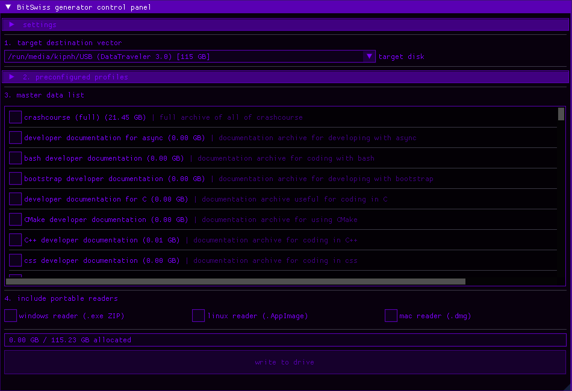

```
        __________________________         _____               
        ___  __ )__(_)_  /__  ___/__      ____(_)______________
        __  __  |_  /_  __/____ \__ | /| / /_  /__  ___/_  ___/
        _  /_/ /_  / / /_ ____/ /__ |/ |/ /_  / _(__  )_(__  ) 
        /_____/ /_/  \__/ /____/ ____/|__/ /_/  /____/ /____/
                                 
                    the multi-platform offline archiver for removable drives.
```


a lightweight, cross-platform, open source C++/Dear ImGui utility to curate, download, and provision massive offline archives onto removable media, easily creating removable, digital "swiss army knives".



this tool allows users to select from a massive ledger of distinct historical, scientific and technical archives,
and have them automatically be downloaded onto any removable storage device.

---
   
## how it works

```
    source (offline ZIM files)
           |   (wikipedia, stackoverflow, etc.)
           V
+----------+-------------------------------------+
|        [ ] BitSwiss core - multi-threaded sync |
|                                                |
|   +--> [reader thread 1] ----+                 |
|   |    (parser 1)            |    concurrent   |
|   +--> [reader thread 2] ----+    processing   |
|   |    (parser 2)            |                 |
|   +--> [reader thread N] ----+                 |
|        (parser N)            |                 |
+------------------------------+-----------------+
           |                   |
           | [optimized data]  | [native runtimes]
           V                   V
+----------+--------+   +------+---------+
|  offline archive  | + |   native apps  |
| (.zim + resources)|   | (linux/win/mac)|
+----------+--------+   +------+---------+
           |                   |
           +---------+---------+
                     |
                     V
             target (portable media)
       +---------------------------------+
       |         [===usb drive===]       |
       | 📂 BitSwiss_archive             |
       |  ├── data (.zim archives)       |
       |  ├── BitSwiss-Linux             |
       |  ├── BitSwiss.exe (windows)     |
       |  └── BitSwiss.app (macOS)       |
       +---------------------------------+
```

BitSwiss reads raw, highly compressed ZIM files (like full offline dumps of wikipedia) and uses multi-threaded parsing engines to process the data concurrently. it then packages the archives alongside native, standalone executables (available for linux, windows, and macOS) directly onto your removable storage, giving you a massive offline knowledge base that runs on any computer.

---

## system architecture

the application decouples data definitions from user configuration management to guarantee mathematically sound allocation and zero-copy memory overhead

* **master data list:** explicitly registers a large library of global assets once. features live asynchronous metadata queries over http to determine exact byte counts on startup without locking the render frame loop.
* **preconfigured tiers:** employs preconfigured data arrays mapping directly to the master data list to provide instant presets tailored for different storage sizes, areas of focus, and more.
* **hardware mapping engine:** intercepts system volume layers to evaluate target file blocks against actual target parameters, automatically enforcing overload guards before writing data.

---

## contents and datasets

the program currently coordinates a comprehensive knowledge and information ledger across multiple domains:

the data includes but is not limited to:
* **the Wikipedia spectrum:** features three distinct fully searchable file sizes (full with pictures, text only, headers and introductions only) containing every Wikipedia entry.
* **the stackexchange matrix:** integrates the entirety of Stack Overflow alongside niche engineering, technology, science, math, literature, art, and more sister forums.
* **massive public domain literature packages:** houses the entirety of Project Gutenberg which includes many texts from the Library of Congress, and thousands of other public domain ebooks. users can choose from the entire collection  or from specific collections.
* **practical hardware and repair:** features the entire comprehensive iFixit repair database that can be used to repair and understand thousands of different devices.

there are also multiple preconfigured datasets including:
* **small storage tailored set:** includes only the most necessary information including wikipedia headers, can fit on a 16gb drive.
* **medium storage tailored set:** includes all of wikipedia (without pictures), all of iFixit, and more. fits on a 64gb drive.
* **large storage tailored set:** includes all of wikipedia (without pictures), iFixit, Gutenberg medical, technological and science collections, and a handful of stackexchange archives.
* **CHUNGUS data set:** includes every single distinct package. very large.

---

## technical stack & dependencies

the project runs natively on cross-platform core engines:

* **gui frontend:** uses Dear ImGui (docking branch) bound to an OpenGL3/GLFW3 backend graphics pipeline
* **network transport:** native 'libcurl' utilizing multi-threaded worker pools ('std::thread') to issue concurrent 'HTTP HEAD' metadata requests
* **cross-platform compilation:** fully compatible with Linux, modern Windows 10/11, and macOS environments.

### system requirements:

to build cleanly, ensure the native developer headers are present on your machine:

* cmake
* gcc
* glfw-devel
* mesa-libgl-devel
* libcurl-devel

---

## building and running

1. create and enter an isolated build folder:
```bash
mkdir build && cd build
```
2. generate build cache using CMake
```bash
cmake ..
```
3. compile the target binary executable
```bash
cmake --build .
```
4. launch the program
```bash
./bitswiss
```

---

## ai usage disclosure

no generative ai or LLMs were used to write or debug any code, headers, or documentation.

---

coded  in C++ using JetBrains CLion

compiled using CMake

GNU general public license

created for Hack Club Stardance 2026 by SwedishSplidney
